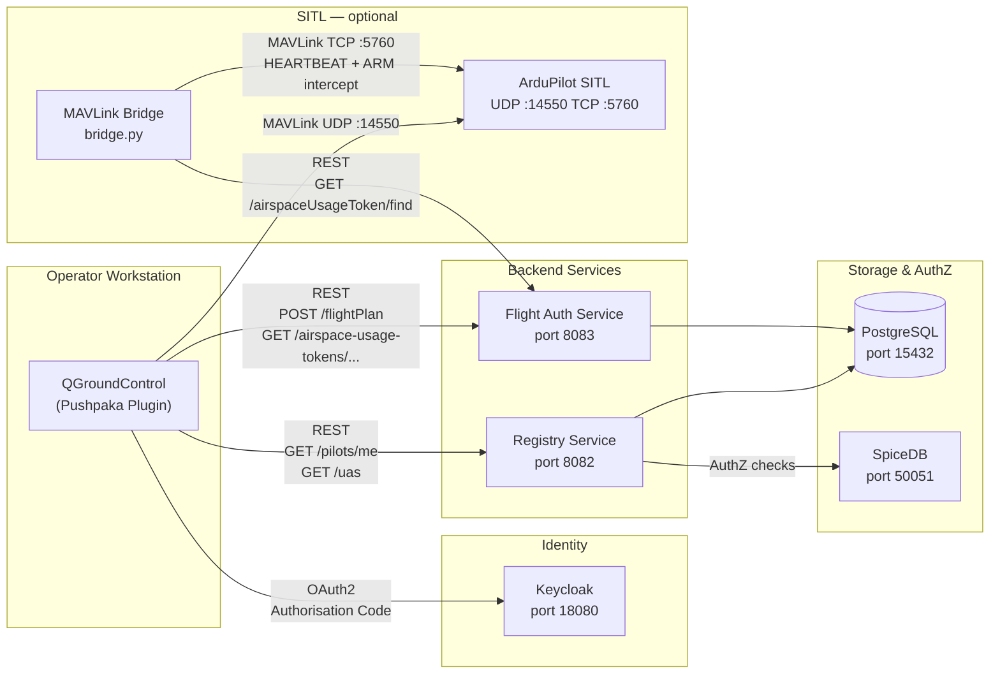

# Pushpaka

Working-group publication repo for drone regulation and UTM standards in India.

Published site: **https://ispirt.github.io/pushpaka/**

---

## Repository Structure

```
pushpaka/
├── docs/                          # PRIMARY OUTPUT — MkDocs knowledge base
│   ├── work-items/                # Work item specs I01–I08
│   ├── openapi/                   # SOURCE-OF-TRUTH OpenAPI specs
│   │   ├── registry.yaml          #   UAS registry (v1.0.17)
│   │   └── flight-authorisation.yaml #   Flight permits and airspace tokens
│   ├── minutes/                   # Working-group meeting records
│   ├── ref/                       # Reference and background documents
│   └── index.md                   # Microsite homepage
├── reference-implementation/      # Illustrative Java/Spring Boot services (I05 scope only)
│   ├── src/main/java/             #   Registry + flight-auth service code
│   ├── src/test/java/             #   AuthZTest, AutTest, DemoScenario1–5
│   ├── src/test/scripts/          #   e2e-smoke.sh
│   ├── docker-compose.yaml        #   Full dev stack
│   └── pom.xml                    #   Maven build (Java 17, Spring Boot 2.7.6)
├── qgc-plugin/                    # QGroundControl UTM enforcement plugin
│   ├── qgroundcontrol/            #   Upstream QGC v5.0.8 submodule (unmodified)
│   ├── custom/                    #   Pushpaka plugin code (QGC Custom Build)
│   └── setup.sh                   #   Wires custom/ into QGC source tree + configures build
├── sitl-bridge/                   # MAVLink bridge — ARM enforcement via AUT check
│   ├── bridge.py
│   └── requirements.txt
├── mkdocs.yml                     # Docs site config (theme: material)
├── requirements.txt               # Python deps for MkDocs
└── .github/workflows/
    ├── main.yml                   # Docs CI — strict build + auto-deploy to GH Pages
    ├── java-ci.yml                # Java CI — runs tests on PRs touching reference-impl
    └── python-ci.yml              # Python CI — ruff lint + format check for sitl-bridge
```

---

## Architecture



Standalone source: [`docs/architecture.mmd`](docs/architecture.mmd)

---

## Working Group Docs

Work items, meeting minutes, OpenAPI specs, and reference documents live under `docs/` and are published as a static site via MkDocs.

```bash
pip install -r requirements.txt
mkdocs serve            # Local preview
mkdocs build --strict   # Verify before deploying
```

GitHub Actions auto-deploys to GitHub Pages on push to `master`.

---

## Specifications

OpenAPI specifications are the **source of truth** for all API contracts.

| Spec | Location |
|------|----------|
| UAS Registry | `docs/openapi/registry.yaml` |
| Flight Authorisation | `docs/openapi/flight-authorisation.yaml` |

`reference-implementation/openapi.yaml` is a downstream copy for code generation — do not edit it directly.

---

## Development Setup

### Requirements

- [Docker Desktop](https://www.docker.com/products/docker-desktop/)
- [VS Code](https://code.visualstudio.com/) + [Dev Containers extension](https://marketplace.visualstudio.com/items?itemName=ms-vscode-remote.remote-containers)

No local Java, Maven, or Python installation needed — the devcontainer provides everything.

### First-time setup

```bash
cp .devcontainer/.env.example .devcontainer/.env
# Edit .env if any default ports conflict with services already on your machine
```

Open in VS Code → **Reopen in Container**. All services start automatically.

> **After pulling changes to `.devcontainer/`** use **Rebuild Container** (`Ctrl+Shift+P` → *Dev Containers: Rebuild Container*) so the updated image is applied.

Alternatively via CLI or GitHub Codespaces:

```bash
docker compose -f .devcontainer/docker-compose.yml up
```

### Environment variables

All connection details are read from environment. See `.devcontainer/.env.example` for the full list.

| Variable | Default | Used by |
|----------|---------|---------|
| `DATABASE_URL` | `jdbc:postgresql://localhost:15432/pushpaka?sslmode=disable` | Hibernate |
| `DATABASE_USER` | `postgres` | Hibernate |
| `DATABASE_PASSWORD` | `secret` | Hibernate |
| `KEYCLOAK_URL` | `http://localhost:18080` | Spring OAuth2 |
| `SPICEDB_TARGET` | `localhost:50051` | SpiceDB gRPC client |
| `SPICEDB_GRPC_PRESHARED_KEY` | `somerandomkeyhere` | SpiceDB auth |

### Running the services

```bash
# Registry (port 8082)
SPRING_PROFILES_ACTIVE=registry mvn compile exec:java \
  -Dexec.mainClass="in.ispirt.pushpaka.registry.RegistryService"

# Flight authorisation (port 8083)
SPRING_PROFILES_ACTIVE=flightauthorisation mvn compile exec:java \
  -Dexec.mainClass="in.ispirt.pushpaka.flightauthorisation.FlightAuthorisationService"
```

---

## Testing

### Docs site

```bash
mkdocs build --strict
```

Runs in CI on every branch push.

### Unit & AuthZ tests

Run inside the devcontainer:

```bash
cd /workspace/reference-implementation
mvn test                        # All tests (AuthZTest + AutTest)
mvn test -Dtest="AuthZTest"     # SpiceDB authorisation layer (30 ordered tests)
mvn test -Dtest="AutTest"       # AUT generation smoke test
```

These run in CI on every PR touching `reference-implementation/`.

### End-to-end smoke test

```bash
./reference-implementation/src/test/scripts/e2e-smoke.sh
```

Boots the full stack (Postgres, Keycloak, SpiceDB), starts the Registry and Flight Auth services, runs API smoke checks (token fetch, `/pilots/me`, flight plan, AUT), and launches QGroundControl.

```bash
./reference-implementation/src/test/scripts/e2e-smoke.sh --no-qgc    # backend only
./reference-implementation/src/test/scripts/e2e-smoke.sh --sitl      # include ArduPilot SITL + MAVLink bridge
./reference-implementation/src/test/scripts/e2e-smoke.sh --teardown  # stop everything
```

> On Windows use **WSL** or **Git Bash** for the smoke script. `sitl-bridge/bridge.py` runs natively on Windows.

### QGC manual walkthrough

Full step-by-step instructions (login → flight plan → AUT → green indicator → ARM enforcement):

[`docs/ref/qgc-testing.md`](docs/ref/qgc-testing.md)

### With ArduPilot SITL (manual)

```bash
# Start SITL alongside the core stack
docker compose -f .devcontainer/docker-compose.yml --profile sitl up -d

# Start the MAVLink bridge (blocks ARM without active AUT)
export PUSHPAKA_TOKEN=<keycloak-bearer-token>
python3 sitl-bridge/bridge.py --require-aut
```

| Endpoint | Protocol | Purpose |
|----------|----------|---------|
| `localhost:5760` | TCP | MAVLink — bridge connects here |
| `localhost:14550` | UDP | QGC connects here |

---

## Contributing

Issues and tasks are tracked in [GitHub Issues](https://github.com/iSPIRT/pushpaka/issues).
Branch naming follows work item IDs (e.g. `i08`) or rebaseline phase IDs (e.g. `rb-03-refimpl`).
