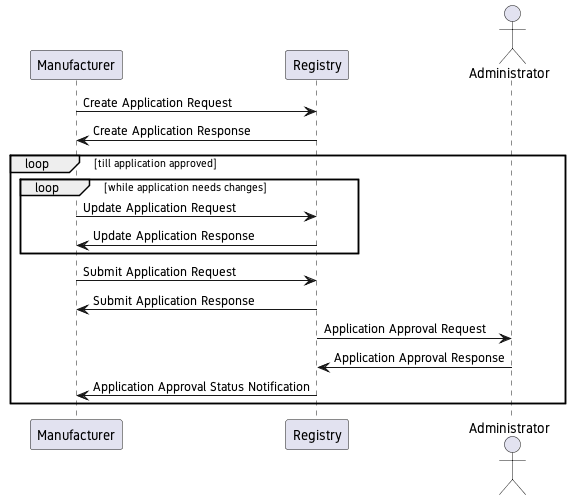
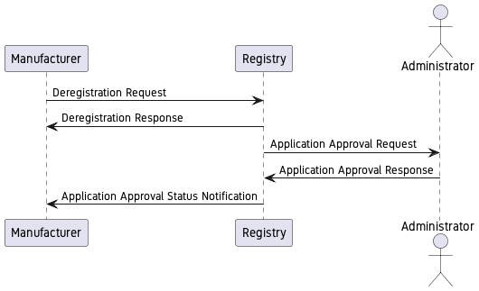
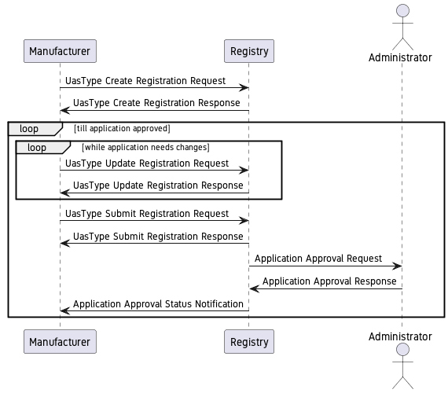
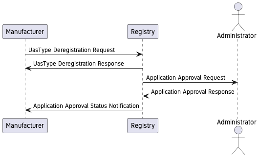
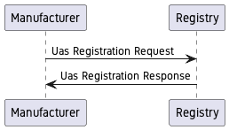
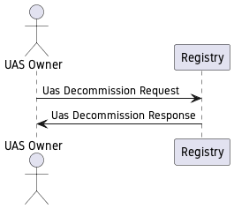

# Software Requirements Specification

## For UTM Registry

Version 0.1  
Prepared by 

* <authors>

Table of Contents
=================
* [Revision History](#revision-history)
* 1 [Introduction](#1-introduction)
  * 1.1 [Document Purpose](#11-document-purpose)
  * 1.2 [Product Scope](#12-product-scope)
  * 1.3 [Definitions, Acronyms and Abbreviations](#13-definitions-acronyms-and-abbreviations)
  * 1.4 [References](#14-references)
  * 1.5 [Document Overview](#15-document-overview)
* 2 [Product Overview](#2-product-overview)
  * 2.1 [Product Perspective](#21-product-perspective)
  * 2.2 [Product Functions](#22-product-functions)
  * 2.3 [Product Constraints](#23-product-constraints)
  * 2.4 [User Characteristics](#24-user-characteristics)
  * 2.5 [Assumptions and Dependencies](#25-assumptions-and-dependencies)
  * 2.6 [Apportioning of Requirements](#26-apportioning-of-requirements)
* 3 [Requirements](#3-requirements)
  * 3.1 [External Interfaces](#31-external-interfaces)
    * 3.1.1 [User Interfaces](#311-user-interfaces)
    * 3.1.2 [Hardware Interfaces](#312-hardware-interfaces)
    * 3.1.3 [Software Interfaces](#313-software-interfaces)
  * 3.2 [Functional](#32-functional)
  * 3.3 [Quality of Service](#33-quality-of-service)
    * 3.3.1 [Performance](#331-performance)
    * 3.3.2 [Security](#332-security)
    * 3.3.3 [Reliability](#333-reliability)
    * 3.3.4 [Availability](#334-availability)
  * 3.4 [Compliance](#34-compliance)
  * 3.5 [Design and Implementation](#35-design-and-implementation)
    * 3.5.1 [Installation](#351-installation)
    * 3.5.2 [Distribution](#352-distribution)
    * 3.5.3 [Maintainability](#353-maintainability)
    * 3.5.4 [Reusability](#354-reusability)
    * 3.5.5 [Portability](#355-portability)
    * 3.5.6 [Cost](#356-cost)
    * 3.5.7 [Deadline](#357-deadline)
    * 3.5.8 [Proof of Concept](#358-proof-of-concept)
* 4 [Verification](#4-verification)
* 5 [Appendixes](#5-appendixes)

## Revision History

| Name | Date    | Reason For Changes  | Version   |
| ---- | ------- | ------------------- | --------- |
|      |         |                     |           |
|      |         |                     |           |
|      |         |                     |           |

## Requirements

### User Roles

1. `REGISTRY_ADMIN`
  1. Assign/Remove Roles for Users
  1. Approve/Reject UAS Type Registration
  1. Approve/Reject Manufacturer Registration
  1. Approve/Reject Operator Registration
  1. Approve/Reject Pilot Registration
1. `FLIGHT_AUTHORISATION_ADMIN`
  1. Approve/Reject Flight Plan
1. `LAW_ENFORCEMENT`
  1. Create Temporary Red Zone
  1. Query Aircraft Authorisation records
1. `PILOT`
  1. Create Flight Plan
1. `AUDITOR`
  1. Read any data

### User Relationships with orgs

1. `TRAINING_ORG_ADMIN`
1. `MANUFACTURER_ADMIN`
1. `OPERATOR_ADMIN`
1. `CERTIFICATION_BODY_ADMIN`
1. `CIVIL_AVIATION_AUTHORITY_ADMIN`
1. `TESTING_LAB_ADMIN`
1. `UTMSP_ADMIN`

### Organisational Roles

1. TRAINING
1. MANUFACTURER
1. OPERATOR
1. CERTIFICATION
1. CIVIL_AVIATION_AUTHORITY
1. TESTING_LAB
1. UTMSP

#### Registration of `LegalEntity`

User should provide

1. CIN/COI
1. Opt. GSTIN
1. Board Resolution authorising XYZ user as admin for Entity
1. COA/AOA
1. Aadhar for Authorised repr./admin user (restrict to Indian Origin?)

Review/approval by Registry Admin
approval should link authorised repr. user and `LegalEntity`

#### Registration of a `LegalEntity` as a Manufacturer/Training/Operator/Certification/TestingLab/UTMSP

Roles

1. OEM: `MANUFACTURER_ADMIN`
1. Administrator: `REGISTRY_ADMIN`

### Manufacturer Profile Management

Roles

1. OEM: `MANUFACTURER_ADMIN`
1. Administrator: `REGISTRY_ADMIN`

#### Registration of a `UasType`

Roles

1. OEM: `MANUFACTURER_ADMIN`
1. Administrator: `REGISTRY_ADMIN`

Roles

#### `Uas` functionality

##### Registration

Roles

1. `MANUFACTURER_ADMIN`

#### Decommission

Roles

1. `UAS_OWNER`

#### Kill

Roles

1. `REGISTRY_ADMIN`

2 Pilot Profile Management

3 UIN Application

4 Permission Management

5 Operator Profile Management / 7 UAOP Application

6 RPAS Acquisition

