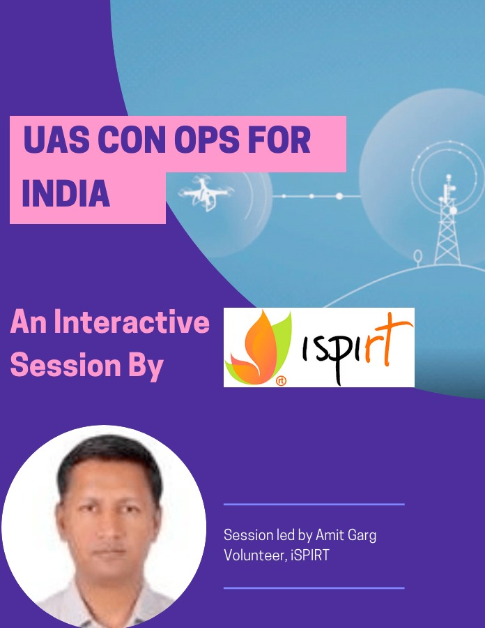

# Feedback Sessions 1-2: Concept of Operations Version 1

ID: `I07`  
Status: `DRAFT`  
Version: `1`  

**Outline**

[TOC]

## Sessions

### Session 1

| Title         | Concept of Operations V1                                     |
| ------------- | ------------------------------------------------------------ |
| Date          | Fri 22nd 730-830p                                            |
| Venue         | [https://bit.ly/OpenHouseonUASOps](https://bit.ly/OpenHouseonUASOps)   |
| Speakers      | Sayandeep, George, Hrishikesh                                |
| Content       | [Presentation](https://docs.google.com/presentation/d/1hHnhkv5FbFT01Q1AUn2fy6fWrDmSZy_G/edit?usp=sharing&ouid=113269142382251111156&rtpof=true&sd=true), [Original Document](i01.md) |
| Feedback form | [https://bit.ly/PushpakaFeedbackForm](https://bit.ly/PushpakaFeedbackForm) |

**Flyer**

### Session 2

| Title         | Concept of Operations v1                                     |
| ------------- | ------------------------------------------------------------ |
| Date          | Fri 29nd 730-830p                                            |
| Venue         | TBD                                                          |
| Speakers      | TBD                                                          |
| Content       | [PPT](https://docs.google.com/presentation/d/1hHnhkv5FbFT01Q1AUn2fy6fWrDmSZy_G/edit?usp=sharing&ouid=113269142382251111156&rtpof=true&sd=true) |
| Feedback form | [Form](https://forms.gle/PGkFuwSifSFVTnSx8>)                 |

**Flyer**

TBD

## Content

### Food for Thought

- **Requirement of Type Certificate**: *Drone Rules 21* mandate airworthiness certification for drones whereas, appropriate standards have not been notified. 
- **Lack of Airspace Integration Vision**: *Drone Rules 2021* lack provisions for eventual integration of drone operations in controlled airspaces.
- **Business confidentiality must be preserved**: The prescribed rules for access to data are not in consonance with the Supreme Court Right to Privacy Judgement
- **Lack of transparent Import Policy**: Places severe restrictions on the import of critical components thus disincentivizing indigenous development of drones in India 

- **Insurance & Training must be market-driven**: Market forces must drive the setting up of specialised training schools & insurance products & once mature they may be mandated & accredited. This will result in the creation of higher quality services & a safer ecosystem.

- **Fostering innovation and becoming Atmanirbhar**: 

- - **Encouraging R&D:** by earmarking airspace for testing for future drones
    - **Encouraging the domestic drone manufacturing industry**: through a system of incentives and disincentivizing imports should be inherent in the Drone Rules. 
    - **Recognition of Hobby flying**: Hobbyists are a vital part of the innovation ecosystem; however, they are not adequately recognised and legitimized

- **Encouraging A Just Culture:** Effective root cause analysis would encourage 
    a safety-oriented approach to drone operations. Penal actions should be the last resort and dispute resolution should be the focus.

- **Enabling Increased Safety & Security**: Clarity on NPNT operationalisation would enhance safety and security manifold.

- **No Clear Institutional Architecture:** Like GSTN, NPCI, NHA, ISRO, etc a special purpose vehicle must be created to anchor the long-term success of drone operations based on an established concept of operations

- **Lack of a Concept of Operations**: Although drone categories have been defined, they have not been used adequately for incremental permissions. Failure to adopt an incremental approach can arguably be considered as one of the root causes of the drone policy failures till date in India as regulations are being framed for too many varied considerations without adequate experience in any. 

### What is a ‘Concept of Operations’?

- A Concept of Operations (ConOps) is a user-oriented document that describes characteristics for a proposed system from an integrated point of view to stakeholders.
- It is produced early in the requirements definition phase to describe what a system will do (*not how it will do it*) and the design rationale.
- It defines any critical objectives and performance requirements.
- The purpose of a ConOps is to describe the operational needs, desires, visions, and expectations of the user without being overly technical or formal. 
- ConOps is useful for obtaining consensus among the users and all other stakeholders on the operational concept of a proposed system.

### Why a ConOps for Drones in India Now

- New field – limited information
- Can have a huge public impact
- Sub-optimal progression of UAS Policy 
- No effective operations despite huge market
- Globally, most of the significant policy progress has come based on defined ConOps e.g. FAA, EASA and ICAO
- Help build consensus faster 
- Enable simultaneous addressing of multifarious bottlenecks

### Drones vs UAS vs RPAS vs Model

- Drones – common/ layman terminology for Unmanned Aircraft (UA). 

- There are three subsets of Unmanned Aircraft : 

- - Unmanned Aircraft
    - Remotely Piloted Aircraft, and 
    - Model Aircraft. 

- Unmanned aircraft system (UAS) – an unmanned aircraft and its associated elements, operated with no pilot on board. Kept away from manned aircraft by airspace restrictions

- Remotely piloted aircraft (RPA) - unmanned aircraft, actively piloted from a remote pilot station. Can use same airspace but subjected to same safety standards as manned aircraft

### ICAO : UAS vs RPAS

...

### Model Aircraft

- Model Aircraft - UA without payload used for educational/ recreational purposes only. 

- Generally model aircraft must meet the following criteria:

- - Be capable of sustained flight in the atmosphere
    - Be flown within visual line-of-sight of the person operating it
    - Be flown for hobby or recreational purposes
    - Not be flown over people or near aerodromes

- Payload - All equipment on board a UAV that are not needed for the flight or its control. It aims exclusively to fulfill a specific mission.

### UAS in India

- UAS in India are currently categorized in accordance with MTOW (including payload) as indicated below: 

- - Nano : Less than or equal to 250 grams. 
    - Micro : More than 250 grams & less than/ equal to 2 kg. 
    - Small : Greater than 2 kg & less than or equal to 25 kg. 
    - Medium : More than 25 kg & less than/ equal to 150 kg. 
    - Large : Greater than 150 upto 500 kg. 

*However no difference in regulations for Small - Large categories; no mention of RPAS and no provisions for Models*

- Use of the terms needs serious review in order to align with the international community and better compliance

### UAS Applications

- Aerial Photography and Videography
- Survey and Mapping
- Inspections of critical infrastructure
- Surveillance
- Agricultural Services
- Cargo Delivery
- Search and Rescue
- Public Security 
- Disaster Relief and Disease Control
- Science and Research
- Entertainment

### Guiding Principles for Developing Regulations

- Efficiency
- Safety
- Security
- Infrastructure Constraints

#### Efficiency

- Regulations need to be UAS-centric and not lean too heavily on traditional manned aviation. 

- Simple regulations with minimal compliance costs needed in order to 

- - provide a fillip to the industry
    - attract investments 
    - encourage legitimate use 
    - Provide time for evolution of standards and ensuing compliance

- Efficient regulations enable 

- - development of market capacity and further innovations
    - reduced gestation period for SMEs
    - wider spectrum of users

#### Safety

- UAS should be progressively integrated into the existing aviation system in a safe and risk-proportionate manner 

- UAS Regulations must 

- - minimize risk to safety of people and assets
    - meet India’s ICAO obligations towards safety
    - meet the safety and operational standards applicable to manned aircraft when operating in non-segregated airspace

- Alternately UAS operations must be restricted to 

- - specific conditions e.g. visual line-of-sight (VLOS); or
    - segregated airspace outside the operational ambit of manned aircraft; or 
    - specific areas e.g. away from heavily populated areas

- Rules must express objectives that are complemented by industry standards

#### Security

- India has long history of sub-conventional warfare in the form of terrorism

- UAS are ideal tool for terrorists

- Potential saturation of our security establishment in differentiating between the ‘good’ and the ‘bad’ actors

- Use of UAS can initially be limited to categories that are

- - easily identified 
    - incapable of significant harm

- Protection of public interests such as personal privacy

#### Infrastructure Issues

- Development of UTM concepts and infrastructure is crucial for large scale UAS use

- UAS Traffic Management based on:

- - Each UAS transmitting a unique remote ID with a geo tracking feature 
    - Unmanned Traffic Management Systems for Very Low Level segregated airspace accommodating exclusive UAS traffic 
    - UAS in non-segregated controlled airspace need to meet manned aircraft standards

- UAS integration in non-segregated airspace will pose challenges

- Development of the UAS market and related technologies needs to be carefully monitored and the planning adapted. 

- Availability of telecom spectrum is fundamental

### Suggested ConOps for India

- Incremental Approach so that

- - Operations commence asap
    - Risks minimized
    - Growth moderated to manageable 

- Risk and Capability Based Approach

- - Category A – Basic UAS Operations with Least Risk
    - Category B – Productive Operations Minimal Risk
    - Category C – Advanced UAS Operations posing Intermediate Risk
    - Category D – Full Range Regulated UAS Operations with Risk Mitigation

#### Category A

- Least risk and require the least infrastructure e.g. small UAS for photography or videography. 

- Suggested operational boundaries :-

- - Operations in Visual Line of Sight (VLOS) only
    - Operations at a safe distance away from people, animals, infrastructure and aerodromes
    - Operations in segregated airspace only till a specified maximum height above ground level (AGL)
    - The UAS capability is limited by design within specific performance limitations such as mass, speed, ceiling, rate of climb, rate of descent etc

#### Category B

- Operations unlikely to result in a fatality or cause serious injury/ damage to persons or infrastructure on ground. e.g. small UASs for survey or agricultural purposes. 
- Operations subject to limited regulatory restrictions that protect other airspace users and life/ property on ground. 
- Require supporting UTM infrastructure but can be undertaken without UTM in a more restricted way. 

- Cat B operational boundaries defined as follows:-

- - Operations by a qualified remote pilot only
    - Operations in Visual Line of Sight (VLOS) or extended VLOS only. 
    - Operations at a safe distance away from people, animals, buildings and aerodromes. 
    - Operations in segregated airspace only 
    - Operations not involving carriage of dangerous goods or articles
    - UAS must have mandatory identification features
    - UAS capability limited by design within specific performance limitations such as mass, speed, ceiling, rate of climb, rate of descent etc
    - Only in fair weather conditions and away from security sensitive areas

#### Category C

- Operations utilizing larger and/or heavier UAS with more payload capacity but posing no challenge to manned aircraft e.g. BVLOS operations in segregated airspace for package delivery
- Low potential to cause fatality or injury to persons on the ground
- Safety challenges limited by restriction to segregated airspace 
- Operations with operational limitations such as payload, pilot qualifications, the establishment of airspace restrictions, altitudes, airspeed, proximity to aerodromes and congested/populated areas 
- Specific Risk Assessment based authorisation that will lead to specific limitations adapted to the operation 

- Operational limitations include:-

- - Operations by a trained remote pilot only
    - Operations at a safe distance away from people, animals, buildings and aerodromes. 
    - Operations in segregated airspace only
    - UAS should have mandatory safety, identification and tracking features conforming to specified standards
    - Enhanced UAS capability but limited by design within specific performance limitations such as mass, speed, ceiling, rate of climb, rate of descent etc
    - Operations subject to availability of adequate UTM infrastructure

#### Category D

- Advanced applications with negligible restrictions on size, the area or complexity of operation or use of airspace e.g. Air Taxi operations 
- Includes, with appropriate mitigations, BVLOS operations within controlled airspace. 
- UAS should conform to well established design characteristics
- Would require significant risk mitigation measures
- Operators to have an adequate management structure to ensure safe operations 
- Licensed remote pilots who are issued licences after successfully completing practical training requirements, pass knowledge tests, meet specific medical standards and age requirements
- UAS will need to be maintained in a safe state for flight and be subject to design standards or other airworthiness certifications
- The aircraft may need to be marked and registered and be able to tracked continually
- Operational rules applicable to this category of operations could be extensive

### Implementing the UAS ConOps

#### Immediate

- Permit Cat A and Restricted Cat B till UTM in place
- VLOS operations in segregated airspace with no special requirements
- Enables Hobby, Video/ Photography and limited agricultural & mapping activities immediately

#### Short Term

- Establish UTM for segregated airspace
- BVLOS operations in segregated airspace
- Specify Design Standards for Advanced UASs
- Enables large scale mapping, survey, delivery and full scale agricultural ops 

#### Medium Term

- Integrated UTM/ATM
- Full range of UAS Ops
- Enables UAM, Large Scale Cargo and special ops including by night

### Category A Operational Limits

- UA with a gross mass of 2 kg or less, and 
- UA is designed to minimise chances of injury to any person in case of accidental collision; and 
- UA is operated always within VLOS; and
- UA is operated at or below 60 m (200 ft) AGL by day only; and
- UA is operated at a safe distance from a person or animal not directly associated with the operation of the UA; and
- UAS is not operated in a prohibited or restricted area; and
- UA is not operated in an airspace notified for use by manned aircraft without prior approval of the controlling authority for such airspace; and
- UAS is used only for hobby flying or photography/ videography.

### Restricted Category B Operational Limits

- UA with a gross mass of 25 kg or less; and 
- UA uses primarily vertical axis rotors to generate its propulsion; and
- UA is designed to minimise chances of injury to any person in case of accidental collision; and 
- UAS is operated by a remote pilot authorised for the operation; and
- UA is operated always within VLOS or enhanced VLOS; and
- UA is operated at or below 120 m (400 ft) AGL by day only; and
- UA is operated in suitable weather conditions; and
- UA is operated at a safe distance away from people, animals, buildings and aerodromes; and
- UA is not involved in the carriage of any parcel or jettisonable load in excess of 5 kgs; and
- UAS is not operated in a prohibited or restricted area; and
- UA is not operated in an airspace notified for use by manned aircraft without prior approval of the controlling authority for such airspace; and
- the remote pilot is able to access web-based updates on any flying restrictions that may have been imposed over the intended area of operations before commencing the flight; and 
- UAS is not operated within 25 kms of India’s international borders or 5 kms of India’s coastline without the prior sanction of the appropriate law enforcement authority.

### Design and Manufacturing

- DGCA/ QCI to specify equipment and design standards for UAS in the micro, small, medium and large categories. 
- Standards for micro and small UAS operations in Cat A or Restricted Cat B on immediate basis and rest in short/ medium term.
- UAS incapable of infringing stipulated height and permanent geographical restrictions by design.
- UAS manufacturers, domestic or foreign, to prove that their UAS conforms to stipulated design and equipment standards for marketing their UAS. 
- Manufacturers accountable in case of any manufacturing or design defects.
- Manufacturers to imprint a unique ID to ensure traceability of the UAS. 
- Manufacturers and traders to maintain record of every transaction of UAS or components to ensure UAS traceability given our security paradigm.

### Remote Pilot Authorisation

- Need to rationalise training needs and costs based on risk assessment.
- Category C and D need practical training and licensing – to be evolved in medium term.
- Practical training under own arrangements for Category A or Restricted Category B operations. 
- Category B operations require pilot to obtain authorisation after undergoing an online DGCA/ QCI certified course. The course followed by an online examination enables authorisation – to be developed in short term.
- Online examination conducted at authorised centres through professional organisations with desired level of quality in the process.
- No requirement of remote pilots to undergo any other formal training for Category A or Restricted Category B operations – immediate.

### Action Plan: Enabling the Ecosystem - Immediate

- Airworthiness Compliance requirements be removed till published
- Remote Pilot training requirements be simplified
- Operations be permitted for Category A and Restricted Category B 
- Guiding principles for Import policy formulation be laid out to incentivise import drone parts and de-incentivise drone models
- Insurance be not mandated for any drone categories
- Enhanced privacy be applied for DigitalSky data access that restricts abuse technically 
- The provision for setting up the Drone Promotion Council be subsumed by a SPV

### Action Plan - Setting up the Long Term Ecosystem

- NPNT be re-notified as a bedrock requirement for operational control

- An SPV outside of entrenched institutions be set up with a charter to

- - Envision India’s concept of aviation operations for the next few decades

    - Formulate Future Policy including: 

    - - Development / update of ConOps
        - Monitor / develop / customize International standards
        - Establish Standards for Airworthiness and Flight Training

    - Develop & operationalise DigitalSky in an open, collaborative fashion

    - Establish an Advisory Committee with equitable membership of stakeholders

    - Address all charter items of the Drone Promotion Council

    - Lay a legal framework for drone data privacy
